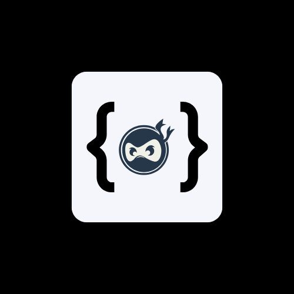

# AI-Assisted NE-IDE 

<p align="center">
  
  <br>
  <strong>NE-IDE</strong>
</p>

The **AI-Assisted Real-Time Code Editor** is a lightweight, collaborative code editor designed for developers to work together in real-time. It integrates AI-powered features like auto-completion, linting, and code documentation generation to enhance productivity and code quality. The editor supports multiple programming languages, real-time collaboration, and a user-friendly interface with customizable themes.

---

## Features

### 1. **Code Editor**
- Lightweight integration with syntax highlighting for multiple languages.
- Multiple themes (dark, light) for better readability.
- Word wrap, line numbering, bracket matching, and automatic indentation.
- File explorer panel for easy navigation.

### 2. **AI-Powered Code Assistance**
- AI-driven auto-completion for function names, variables, and keywords.
- Real-time linting with quick-fix suggestions.
- Predefined code snippets for frequently used blocks.
- AI-powered code documentation generation.

### 3. **Real-Time Collaboration**
- Multi-user editing with live cursor positioning.
- In-editor comments for discussions.
- Activity log to track recent edits and user actions.
- Auto-save and undo/redo history for version control.

### 4. **Security & Authentication**
- Email and Google OAuth login.
- Two-factor authentication (2FA) via OTP or TOTP.
- Private and public workspaces for controlled access.
- Password reset functionality.

### 5. **User Experience & UI Enhancements**
- Dark and light mode toggle.
- Customizable font size and color themes.
- Collapsible sidebar for maximizing workspace.
- Simple and intuitive user interface.

---

## Demo

<p align="center">
  
  <br>
  
</p>
<p align="center">
  
  <br>
  
</p>
<p align="center">
  
  <br>
  
</p>
---

## Installation

### Prerequisites
- Node.js (v16 or higher)
- MongoDB (v5 or higher)
- OpenAI API key
- Judge0 API key (optional for code execution)

### Steps
1. Clone the repository:
   ```bash
   git clone https://github.com/your-repo/ai-code-editor.git
   cd ai-code-editor
   ```
2. Install dependencies:
   ```bash
   npm install
   ```
3. Set up environment variables:
   Create a `.env` file in the root directory and add the following:
   ```env
   MONGO_URI=mongodb://localhost:27017/codeditor
   OPENAI_API_KEY=your_openai_api_key
   JUDGE0_API_KEY=your_judge0_api_key
   SOCKET_SERVER_URL=http://localhost:5000
   ```
4. Start the backend server:
   ```bash
   cd backend
   npm start
   ```
5. Start the frontend:
   ```bash
   cd frontend
   npm start
   ```
6. Access the application:
   Open your browser and navigate to `http://localhost:3000`.

---

## Usage

### 1. **Joining a Room**
- Enter a room ID and your name.
- Click **Join Room** to start collaborating.

### 2. **Editing Code**
- Write code in the editor. Changes are reflected in real-time for all users in the room.
- Use AI-powered features like auto-completion and linting for better productivity.

### 3. **Running Code**
- Click **Run Code** to execute the code.
- For JavaScript, the output is displayed in the output box.
- For other languages, the code is executed using the Judge0 API.

### 4. **Leaving a Room**
- Click **Leave Room** to exit the current room and return to the join room screen.

---

## Contributing

We welcome contributions! Please follow these steps:

1. Fork the repository.
2. Create a new branch:
   ```bash
   git checkout -b feature/YourFeatureName
   ```
3. Commit your changes:
   ```bash
   git commit -m 'Add some feature'
   ```
4. Push to the branch:
   ```bash
   git push origin feature/YourFeatureName
   ```
5. Open a pull request.

---

## License

This project is licensed under the MIT License. See the `LICENSE` file for details.

---
##Contripution

The following individuals have contributed to the development of NE-IDE:

 -Abi Gayathir

 -Sri Hari Prasath

 -Sandhosh
---

### How to Use This `README.md`
1. Copy the above Markdown content.
2. Paste it into a new file named `README.md` in the root directory of your project.
3. Replace placeholders (e.g., `your-repo`, `your-demo-link.com`, `your.email@example.com`) with your actual project details.
4. Add a logo or demo GIF if available.

